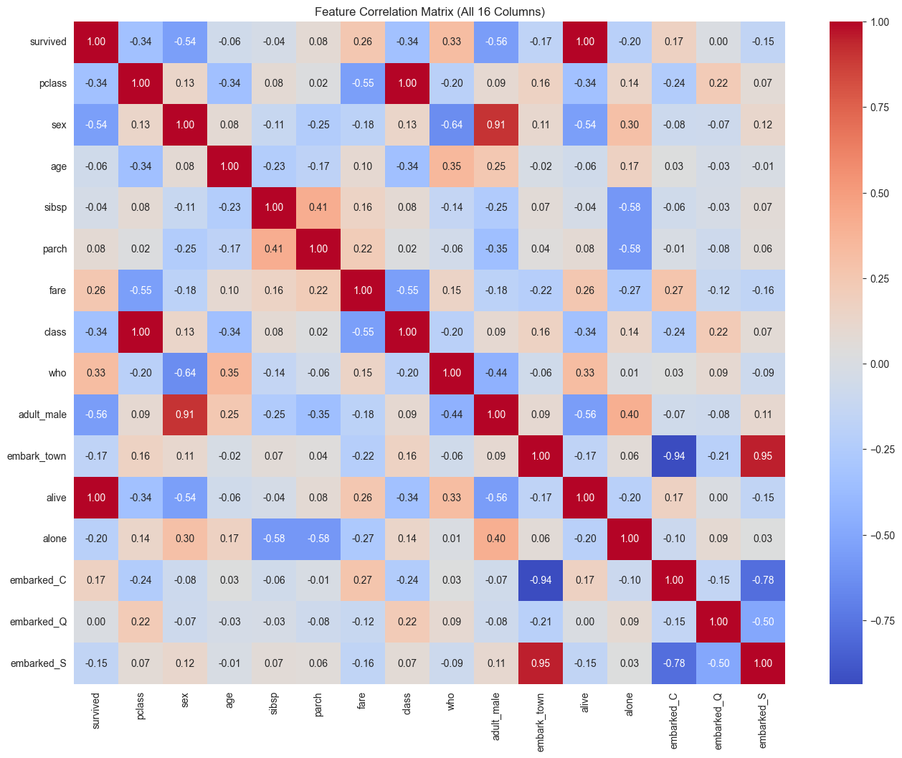
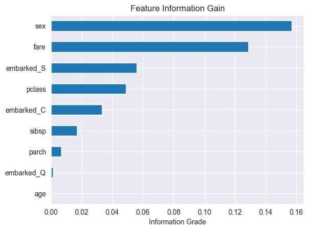

# Titanic Survival Classification Model 
---

# Pre-Processing
The provided 15 feature dataset had 891 rows of data. The data imported from seaborn was lacking and had some quality challenges that needed to be addressed before we can start training our model.

**Missing Values** 
Thankfully only 3 features had missing values : 
1. **age**: had 20% of its values missing and was imputed with the median to not skew the distribution
2. **embarked**: only 2 rows were missing and mode was used as it was a categorical feature
3. **deck**: This feature unfortunately had a majority missing which we dropped to avoid data fabrication.

**Categorical Encoding** 
we applied encoding to make the data compatible for sklearn. The encoded features were : 
1. **Sex**: label encoded as 1 = male and 0 = female
2. **embarked**: was one hot encoded with each class being its own binary feature (`embarked_C`, `embarked_Q`, `embarked_S`).

**Feature Scaling** 
We also made sure our continous features were all scaled appropriately as well, they were all scaled using the `z-score` scaling as it is better optimized for SVM models since the whole concept of SVM is we are moving around a center. Also keep in mind that svm is sensitive to non normalized features.
We applied this scaling to the following features: 

1. **age** 
2. **fare** 
3. **sibsp** (siblings)
4. **parch** (parents and children)

## Worth Mentioning
I took the liberty of seeing if we should drop or apply ceilings via the box plot method. However after looking at the 
data I did not sense there were outliers but rather it was actual data the model should be able to adhere to.

---
# Feature Selection
Selection was done by two phases, High correlation dropping and low information gain drop.

**Correlation Dropping**

After creating a heatmap, from the illustration cell in the notebook, we noticed some high correlations amongst features, it could also be noticed that some classes were derivatives were others. Look at the following: 
- **alive** : same as our target prediction (`survived`), so no need for duplicate.
- **class** : duplicate of `pclass`
- **adult_male** : could be extracted from `age` and `sex`
- **who** : could also be derived from `age` and `sex`
- **embark_town** : could be dropped since we have done a one hot encoding
- **alone** : derived by siblings, parents and children columns.

Take a look at the correlation heatmap below:



**Information Gain** 

We then used IG on the remaining 10 features. After some visualizations from the notebook. We noticed that `sex` and `fare` were the highest information gain for our classifier, we also noticed that `embarked_Q` showed near zero gain which made sense for its very little data and affect on the results. Age surprisingly had a zero information gain but we chose to keep it as it logically seems as it will come in handy later on and has plenty data.

Take a look at the information gain chart below:



The final feature set consisted of 8 features: pclass, sex, age, sibsp, parch, fare, embarked_C, embarked_S.

---
# Parameter Tuning 
**Data comes first** 
We first used a kfold approach so the model could be tested across all the data to make sure our models are not biased or not sensitive to the data distributions.

**SVM Tuning**
At first we did a naive approach as doing variations one by one : (`linear`, then `rbf`, then tuning the `c` manually, then the `gamma`). These two resulted in a non linearly seperable data with c being 1. When we tuned the gamma we realized that we can do all these tunings in one go using all these parameters as a dictionary and passing it into training with `gridsearchcv`.
We passed in : 
```
parameters = {
    'kernel': ['rbf', 'linear'],
    'C': [0.01, 0.1, 1, 10, 100],
    'gamma': [0.001, 0.01, 0.1, 1, 10, 100, 'scale', 'auto'],
}
``` 
The results gave us a gamma of `Scale`.
Before we reached the scale option, we used numeric options and found that our model performed worse than the default, when we added scale as a possible gamma parameter, we noticed the model instantly jumped to being the same quality as the default. 

**Random Forest Tuning** 

In this pass we learned to not do this one by one and use the gridsearch with the parameters dictionary. 
We passed on these values : 
```
 randomForestParameters = {
    'n_estimators': [50, 100, 200, 300],
    'max_depth': [None, 1,2,3,4,5,6,7,8], # we only have 8 features we do not need more than that depth
    'min_samples_split': [2, 5, 10, 20],
}
```
With GridSearchCV providing that best configuration was `n_estimators`=300, `max_depth`=8, `min_samples_split`=2, improving accuracy from 82% to 84%.

--- 
# Evaluating 
All evaluation used `cross_val_predict` with the stratified 5-fold setup to produce predictions across the full dataset.

### SVM vs Random Forest (Tuned Models)

| Model | Accuracy | F1-Score |
|---|---|---|
| SVM | 82.49% | 75.93% |
| Random Forest | 84.62% | 78.43% |

Random Forest outperformed SVM across all metrics. SVM's performance did not change with tuning, suggesting the dataset's patterns are better predicted using the Random Forest approach.

### Default vs Tuned

| Model | Default Accuracy | Tuned Accuracy | Default F1 | Tuned F1 |
|---|---|---|---|---|
| SVM | 82.49% | 82.49% | 75.93% | 75.93% |
| Random Forest | 82.49% | 84.62% | 75.93% | 78.43% |

Tuning had no effect on SVM as the best parameters matched sklearn defaults. Random Forest improved with tuning (+2.13% accuracy, +2.50% F1).

### Before vs After Preprocessing

| Model | Accuracy Before | Accuracy After | F1 Before | F1 After |
|---|---|---|---|---|
| SVM | 67.37% | 82.49% | 46.44% | 75.93% |
| Random Forest | 79.00% | 84.62% | 74.00% | 78.43% |

Preprocessing had the most dramatic impact on SVM (+15.12% accuracy, +29.49% F1), confirming SVM's sensitivity to feature scaling. Random Forest showed a more modest improvement (+5.62% accuracy), as expected with its robustness to unscaled features.

---
# Conclusion 

**Best overall model:** The tuned Random Forest achieved the highest performance at 84.62% accuracy and 78.43% F1-score. Given the class imbalance in the dataset (61.6% / 38.4%), F1-score is the more meaningful metric, and Random Forest leads on both.

**Impact of preprocessing:** Preprocessing had a significant positive effect on both models, with SVM benefiting the most. The combination of scaling, imputation, and feature selection removed noise and brought the data into a form where the models could learn meaningful patterns. Without preprocessing, SVM performed near-random at 67% accuracy.

**Impact of parameter tuning:** Tuning produced meaningful gains for Random Forest but not for SVM. The SVM's optimal parameters matched the sklearn defaults, suggesting the model had already reached its performance ceiling on this dataset given the chosen features. Random Forest benefited from a larger tree count and constrained depth, balancing bias and variance more effectively.